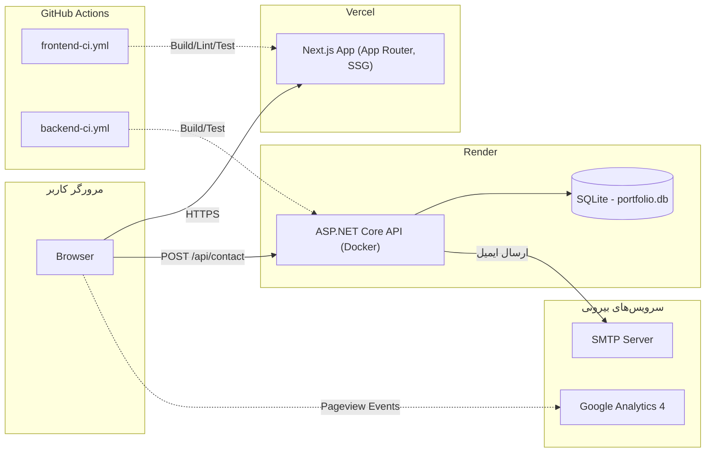
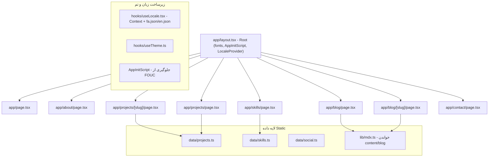
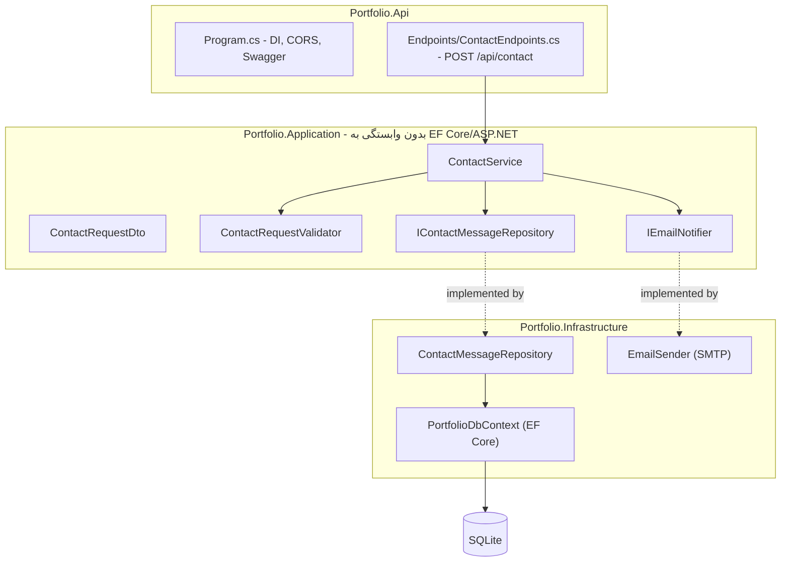
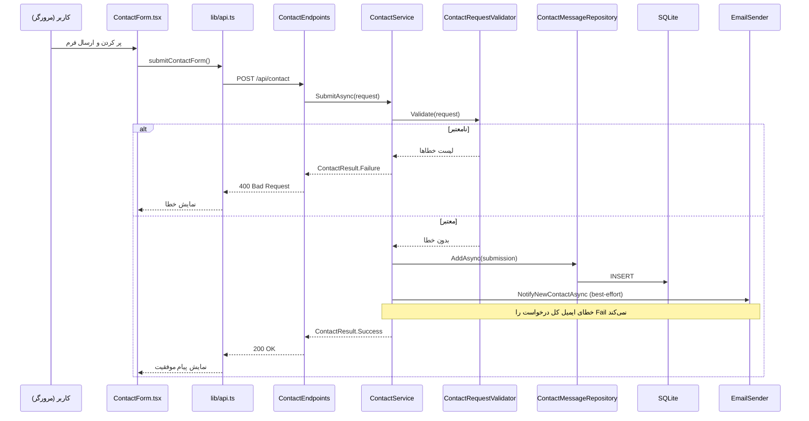

# معماری پروژه

این سند تصویر کامل معماری سایت را نشان می‌دهد — هم فرانت‌اند، هم بک‌اند، هم نحوه ارتباطشان با هم و با سرویس‌های بیرونی.

---

## ۱. نمای کلی سیستم (Deployment Topology)

**نکته کلیدی:** فراخوانی `NEXT_PUBLIC_API_URL` مستقیماً از **مرورگر کاربر** به سرویس Render انجام می‌شود — نه از سرور Vercel. به همین دلیل CORS در بک‌اند (`Cors__AllowedOrigin`) باید دقیقاً آدرس دامنه فرانت‌اند را داشته باشد.

---

## ۲. معماری فرانت‌اند (Next.js)

**الگوی هر صفحه (از فاز ۶ به بعد):** `page.tsx` یک Server Component است (برای `metadata` و خواندن داده)، و رندر واقعی را به یک `XContent.tsx` جدا (Client Component که از `useLocale` استفاده می‌کند) واگذار می‌کند. مثلاً `about/page.tsx` → `AboutContent.tsx`.

### تصمیم‌های کلیدی فرانت‌اند
- **رنگ‌ها:** به‌جای Hex ثابت، از CSS Custom Properties استفاده می‌شود (`:root` برای روشن، `.dark` برای تیره) — Tailwind فقط به آن‌ها ارجاع می‌دهد (`docs/color-typography.md`, فاز ۶).
- **زبان:** یک مسیر واحد (نه `/fa` و `/en` جدا)؛ سوییچ زبان کاملاً سمت کلاینت با Context انجام می‌شود. بدنه بلند محتوای فنی (Case Study، پست‌های بلاگ) عمداً فقط فارسی مانده (تصمیم فاز ۶ و ۷).
- **داده:** پروژه‌ها و مهارت‌ها در فایل‌های TypeScript static (`data/`) نگه‌داری می‌شوند — نه CMS یا دیتابیس؛ بلاگ در فایل‌های MDX (`content/blog/`) با Frontmatter.

---

## ۳. معماری بک‌اند (ASP.NET Core)

### چرا سه‌لایه ساده، نه Clean Architecture کامل؟
StudentInsights (پروژه اصلی من) از Clean Architecture + CQRS استفاده می‌کند چون چند نفر روی ماژول‌های متعدد کار می‌کردند. این بک‌اند فقط یک فرم Contact دارد — همان سطح پیچیدگی برایش Over-engineering بود. این ساختار سبک‌تر (Api → Application → Infrastructure) پیچیدگی متناسب با مقیاس واقعی مسئله را نشان می‌دهد؛ جزئیات این تصمیم در تاریخچه فاز ۲ پروژه مستند است.

---

## ۴. جریان کامل یک درخواست Contact

---

## ۵. جمع‌بندی تصمیمات معماری مهم پروژه

| تصمیم | چرا |
|---|---|
| Next.js به‌جای React خام | SEO، پیش‌نمایش لینک (OG)، بلاگ قابل ایندکس (فاز ۲) |
| ۳-لایه سبک به‌جای Clean Architecture کامل | تناسب پیچیدگی با مقیاس واقعی این سرویس (فاز ۲) |
| SQLite به‌جای SQL Server | کافی برای حجم داده این پروژه، بدون نیاز به سرور دیتابیس جدا (فاز ۲) |
| Monorepo واحد | ارائه حرفه‌ای‌تر در GitHub، مدیریت ساده‌تر Issue/PR (فاز ۲) |
| بلاگ با فایل MDX، نه CMS/دیتابیس | سادگی؛ بدون نیاز به دیتابیس یا پنل مدیریت جدا (فاز ۲ و ۷) |
| زبان: مسیر واحد + Context، نه روت‌های /fa و /en | سادگی معماری؛ محتوای بلند فنی فقط فارسی می‌ماند (فاز ۶) |
| رنگ‌ها: CSS Variables به‌جای Hex ثابت | امکان Dark/Light واقعی بدون تغییر نام کلاس‌ها (فاز ۶) |
